# Begonia

**Begonia is a Matlab framework developed by [Glialab](https://www.med.uio.no/imb/english/research/groups/glial-cells/) that helps solve some core challenges of scientific image analysis of 2-photon imaging data of astrocytes.** 

**Some of its features are: (1) simple and low maintainence metadata storage strategy, (2) integrating manual steps of analysis with custom Matlab tools, (3) processing of image data agnostic to miscroscope type / image source, (4) joining time series data from multiple measurement devices and sources, and (5) automatic or semi-automatic analysis of imaged cells and tissue events visible with dynamic calcium sensors**.

The development's primary focus has been on astrocytic calcium signaling, but the software can be used for a range of fluorescence indicators recorded by 2-photon laser microscopy.

The system offers some graphical workflow for non-programmers and an API for programmers. We find that the combination of GUI tools and Matlab processing APIs works well and that researchers supported by others with more programming experience allow high productivity with this framework. 

Non-programmers can use the framework initially for an overview of data and automatic analysis for project piloting or quick reviews of data as it is collected.


# Known issues ⚠️

Please be aware of the following when using the RoI Manager ("roiman"):

* A bug prevents roimanager getting keyboard event if timeseries view is raised by clicking inside the window. Workaround: click the titlebar of a window before clicking inside it to draw RoIs etc.
* Due to and incoherence in Matlab's App Designer's behaviour, Mac users using the RoI manager need to command-click to activate buttons in windows that are not topmost. Clicks without the command button raises windows, but events do not register inside them.
* Due to limitations in Matlab's App Designer, controls that have focus blocks keyboard shortcuts. This means you may not be able to use keyboard shortcuts after making selections in drop-down menus unless you click the editor or tool window first.

# Paper 

Bjørnstad DM, Åbjørsbråten KS, Hennestad E, Cunen C, Hermansen GH, Bojarskaite L, Pettersen KH, Vervaeke, K, Enger, R. [Begonia—A Two-Photon Imaging Analysis Pipeline for Astrocytic Ca2+ Signals](https://doi.org/10.3389/fncel.2021.681066). Front Cell Neurosci. 2021;15(May):1–12.

# External code
Wouter Falkena (2021). [xml2struct](https://www.mathworks.com/matlabcentral/fileexchange/28518-xml2struct), MATLAB Central File Exchange. Retrieved August 16, 2021.


# Videos and GUI hints

We refer to [our YouTube playlist](https://www.youtube.com/playlist?list=PLp3p4GiuHqnL8w1SXF-6g0CsLld0nl3zg) that demonstrates the main workflow of begonia from start to finish.

Specific videos:
* [Workflow overview](https://youtu.be/mzcugrLk4rk)
* [Installation](https://youtu.be/De_7MfuIO1E)
* [Import, sessions, motion correction, batch operations](https://youtu.be/QuaAMHsj28g)
* [Dataman filtering](https://youtu.be/riIy2mJ_gqQ)
* [Dataman "data" menu, Matlab command window interoperability](https://youtu.be/3X8d8_k-j-U)
* [DataLocation (metadata) overview and API](https://youtu.be/aEwbBqXdIhY)
* Regions-of-interest (RoIs): 
    * [Marking](https://youtu.be/2501a9V6ap8)
    * [processing 1](https://youtu.be/0ScSfpPVu1s)
    * [processing 2](https://youtu.be/FSoLAL-Io6M)
* RoAs (activity detection): 
    * [Part 1 - SNR optimization](https://youtu.be/tjhT51NWOj0)
    * [Part 2 - Baseline treshold](https://youtu.be/dVeicKcn_rM)
    * [Part 3 - Result inspection, processing with RoIs](https://youtu.be/P0BMCA14ErA)
    * [Part 4 - Plotting, CSV export](https://youtu.be/I9_H8V7H1Wc)


Cheatsheet to navigate the RoI manager:

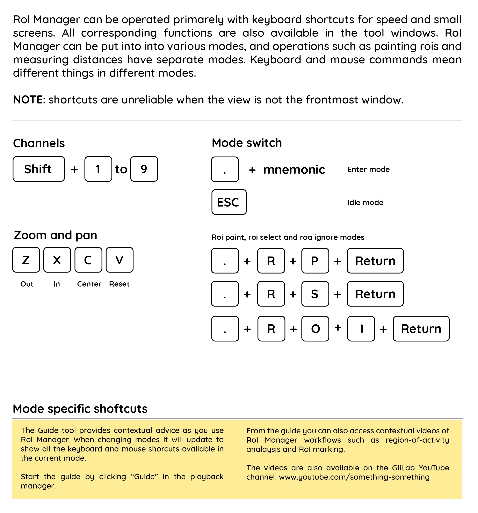

# Quick start (for programmers)
The repository must be initialized with submodules to function correctly. The current submodules that Begonia depends on are the motion correction software, 
NoRMCorre, and a modified version of the TIFF reading library, TIFFStack. The submodules are located under `Begonia/external`. 

Submodules can be initialized with:
```
# git submodule update --init --recursive
```


# Metadata

We define metadata as data added to recordings of various modalities that are not part of the original data. 

Practical examples can be: a table of regions-of-interest (ROIs) marked in an image recording, the signals from these ROIs, the name of a laboratory animal used in an EEG recording, or a list states a sleeping animal undergoes during an image recording session.

Take this example: a mouse runs on a wheel while the pupils are filmed. The experiment yields a file with the wheel's change in degrees over time and the pupil images. When the researchers later analyze these raw data, they might calculate the speed in cm/second and the pupil diameter. 

Where do these complex derived datatypes go? 

In Begonia, we associate such metadata directly with raw data using the `DataLocation` class, found in the `begonia.data_management` namespace. The recording data types in Begonia derive from this class, meaning it is straightforward to add new data to existing data no matter the type.

Any path in the filesystem - files and directories - can be opened as a `DataLocation`. Example: if you have a multipage TIFF file at `C:\imageseq.tiff` this can be opened as a `DataLocation` object in Matlab. Another example might be a directory of .PNG images at `C:\Data\session-2-july`. Doing so creates a metadata directory associated with the file, and any data associated with the file can be written to disk, such as the ROIs marked in the recording. No additional setup is needed, such as configuring an ontology description or a database. 

The `MultiTable` can collate data from multiple sources that provide time-series type data to complement this system. If your experiment sessions rely on multiple data sources, you might want to review this namespace further down in this document. 

`DataLocation` also provides a storage engine system, adding flexibility to where the metadata is stored. By default, the system sets every `DataLocation` to use the `OnPathEngine`, meaning the metadata directory is store adjacent to the path in the filesystem. For files, this means in the file's directory, and for directories, it means inside the directory itself. At GliaLab, we often use the alternative `OffPathEngine`, which saves metadata in a separate directory that must be specified when instancing the data location. 

There also exists an abstract `DataLocationAdapter` class that adds the API to *any* Matlab object that inherits from it. This means Matlab objects create for other purposes can be opened using tools that expect a data location. 

These objects are rarely created on their own, however. In Begonia, we tend to inherit from DataLocation for almost all classes that read data from a location. It means that any object representing an image recording, be it volumetric 3D data, single images, line scans or time-series, all will take part in this metadata system.

For testing and technical purposes, a data location can be easily instanced:
```matlab
import begonia.data_management.DataLocation;

animal = "micky.mouse";
genotype = categorical("imaginary");
age_years = 95;

dloc = DataLocation("C:\imageseq.tiff");

% write metadata:
dloc.save_var(animal); % save with variable name
dloc.save_var("gt", genotype); % specify name
dloc.save_var("age", age_years); 

% clear variable, read data back:
clearvar dloc
dloc = DataLocation("C:\imageseq.tiff");

animal = dloc.load_var("animal");
age = dloc.load_var("age");
other = dloc.load_var("does-not-exist", 3.14);  % default value

if dloc.load_var("is_mouse", false)
    disp("this would not show");
end

% check if variable exists:
if dloc.has_var("age")
    %  ...
end

% open the location in system's default file browser:
dloc.open();

% change storage engine (see demonstration video):
import begonia.data_management.OffPathEngine;

dloc.dloc_storage_engine = OffPathEngine("\Media\SSD_disk2\project_metadata");
% use as before - data gets saved to the SSD disk instead of source
```
`DataLocation` also has a `.dl_changelog` property that can be read to see when a variable was saved.

# DataLocation Editors

We have found it is often necessary to perform manual steps implemented in Matlab for many imaging data files in a row. Examples are setting thresholds while seeing an image, marking areas to include or exclude, marking ROIs, processing steps etc. 

A simple project could record 50 x 5-minute recordings on brain slices before and after a stimulus, marking ROIs and then processing the ROI signals before performing statistics. For the 50 recordings, the same steps need to be performed.

These steps often vary from project to project and are frequently custom-made for the specific project. When there are many recordings, it is good to know what steps have been performed on what recording.

Begonia offers a visual spreadsheet-like tool in `xylobium.dledit.Editor` for this purpose that works on any list of DataLocation or DataLocation derived data.

We refer to this tool as the *DataLocation Editor*. Note that Begonia's *Data Manager* is implemented in this way. A good place to start for a practical example of a completed DataLocation editor is to have a look at the script `dataman.start()`. 

If you have a list of data locations, programmatically opening them with an editor is easy. Notice how you can make a column editable by adding a "!" in front of it:

```matlab
import begonia.data_management.DataLocation;
import xylobium.dledit.Editor;

dl1 = DataLocation("C:\Data\Recording 1");
dl2 = DataLocation("C:\Data\Recording 2");
dl3 = DataLocation("C:\Data\Recording 3");

% create some test data:
s = struct();
s.message = "hello dloc";

dl1.save_var("A", 3.14);
dl2.save_var("B", s);

% open an editor, with a editable column A:
Editor([dl1, dl2, dl3], [], ["path", "!A", "B"]);
```
This code produces the following view:

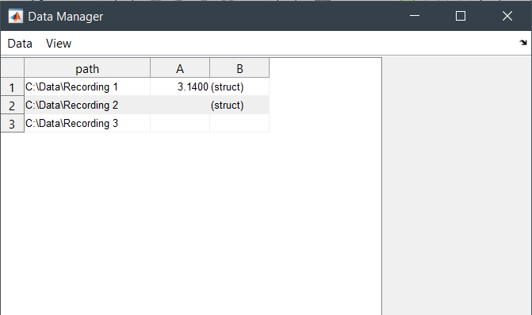

Actions to be performed on the items in the list can be added by instancing `xylobium.dledit.Action` and providing them as a list of actions. Actions have flags that display them as buttons and menu items, optionally with a button group or separator to clarify their relations.

Note that setting an action's `.can_queue` enables it to be run as a batch operation. These actions are marked with a (b) in the user interface. Similarly, it is possible to set `.accepts_multiple_dlocs` to true to perform the action once per selected item or false for once per item.

Continuing with the example, we now add some buttons to the mix:

```matlab
% instance with actions:
import xylobium.dledit.Action;

act_A = Action("Show A", @(d, m, e) disp(d.load_var('A')));
act_A.has_button = true;
act_A.button_group = "Actions";
act_A.menu_position = "Tools";

act_B = Action("Show B's message", @(d, m, e) disp(d.load_var('B')));
act_B.has_button = true;
act_B.button_group = "Actions";
act_B.menu_position = "Tools";

xylobium.dledit.Editor([dl1, dl2, dl3], [act_A, act_B], ["path", "!A", "B"]);
``` 
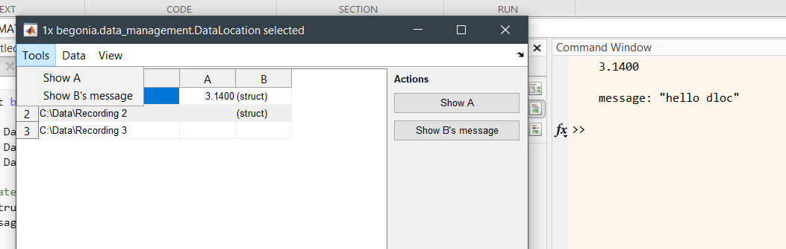


# Scantypes

Begonia offers a collection of functions to load imaging data and parse associated metadata. The library was developed for Bruker Prairie Microscope but has further been developed to load multipage TIFF stacks and ScanImage metadata. Functions to load imaging data is found in the `begonia.scantype` library. 

Conceptually, we have declared several abstract classes that specific source readers inherit and override. Also, these classes use multiple inheritance to mix in `DataLocation` support. 

Nota that all these classes must have a constructor that takes a filesystem path to the location of the data.

The library can in this way be extended to support other file formats and microscopes, yet retain compatibility with all existing tools begonia offers. 

Loading imaging data:

```matlab
% get scans from a directory stucture of your choosing:
scans = begonia.scantype.find_scans(uigetdir());

% open the scans in the data manager:
dataman.start(scans) 
```

## H5 data format + custom metadata

When timer series data gets big, it is often good to have a lazy reader that can rapidly scrub to specific frames in a recording and load only what is needed. Begonia provides such a lazy reader for the H5 data format. This is the default data format of Begonia.

For legacy compatibility in our own data we've also implemented a H5Old reader.


## TSeries-derived types

The most commonly used data format in our research is the `begonia.scantypes.TSeries` data type. The format support multiple channels per recording. Initially, we supported "cycles" as this was a feature of our microscopes at the time development started, but this is being phased out. The cycle parameter will frequently be ignored.

This class offers the following API:

**Methods**

* `get_mat(ch, cy)` to retrieve a reader for the requested channel
* `get_avg_img(ch, cy)` reference image: average
* `get_std_img(ch, cy)` reference image: standard deviation
* `get_max_img(ch, cy)` reference image: max value 
* `load_var(name, default)` load metadata (from `DataLocation`)
* `save_var(name, (value))` save metadata (from `DataLocation`)
* `has_var(name` check if metadata present (from `DataLocation`)
* `saved_vars()` list metadata (from `DataLocation`)

Note: reference images will be generated on request, which can be time consuming. Data Manager provides a batch processing action for these operations.

**Properties**

* `uuid` a unique ID for the data (generated on first request)
* `name` recording name
* `channels` number of channels
* `channel_names` names of the channels
* `source` the provider, such as Prairie, or ScanImage
* `start_time` start time
* `time_correction` correction to start_time 
* `start_time_abs` start time of recording, corrected for time_correcton
* `duration` duration of recording
* `frame_count` numebr of frames
* `zoom` number indicating zoom level
* `img_dim` dimentions of image [w h]
* `dt` delta-time, seconds between frames
* `dx`/`dy` micrometers pr. pixel on the x and y axis

In this example, we will load a scan from a known location. We will show the average image in a figure, and also show the timeseries using roiman:

```matlab
% load the scan (can give more than one, here we just get one):
% open the tseries:
path = "C:\TSeries-02202018-0826-019_aligned";
tseries = begonia.scantype.find_scans(path);

% load the average image:
avg_mat = tseries.get_avg_img(1,1);
figure(); 
imagesc(avg_mat);
``` 
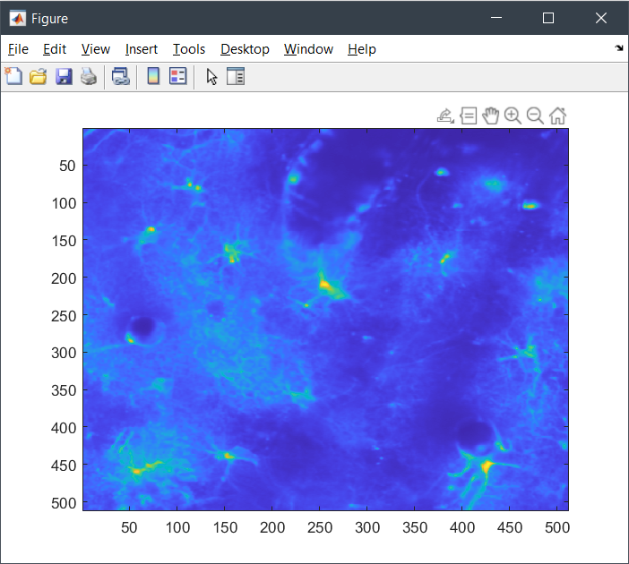

To get the full data in x, y, and time dimensions, use `.get_mat(ch, cy)`. The returned result will depend on the underlying data format. In the example case, the data is a processed H5 TSeries, meaning we will get a lazy H5 reader and can be sure we are not overloading our memory.

The data type of the frames returned by the reader can also change depending on the reader and the data. 

In this example, we will use `roiman.show`. This opens a minimal version of the ROI Manager that takes any Matlab matrix. If the second parameter is true, a control panel will be shown. If false, it displays only the matrix. Note that roiman.show works for all matricies but does not provide details about the data. To properly open TSseries, one would use e.g. roiman.tasks.edit_rois(tseries);

```matlab
% to simply show a matrix, we can get that an visualize it:
mat = tseries.get_mat(1,1);
roiman.show(mat, true);
```
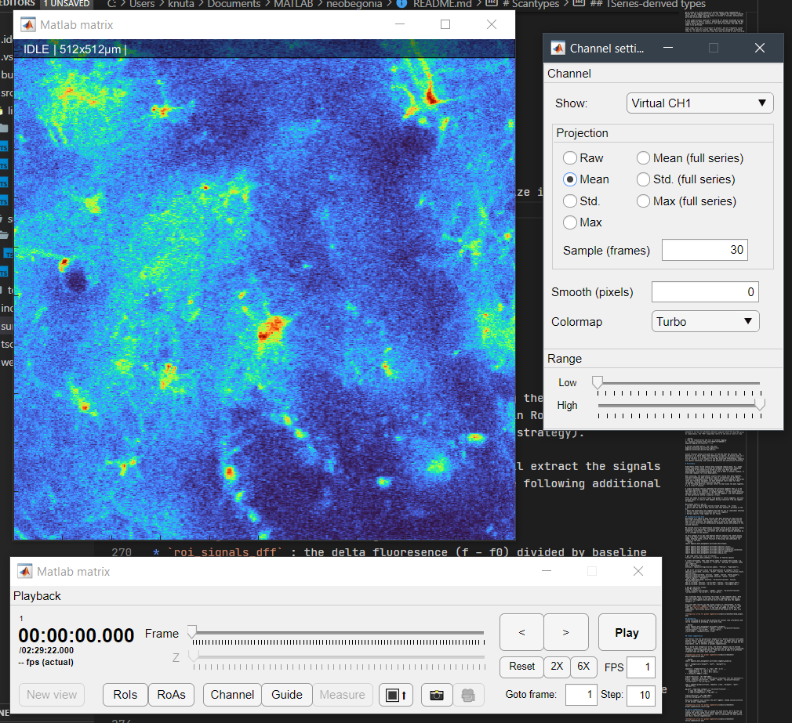

## Other scantypes

In this initial release, we are focused on TSeries objects and only provide documentation on these. However, more scan types can be loaded from a path, such as 3D z-stacks, line scans, and single images. All adhere to the `DataLocation` mechanism.

# Regions-of-activity
Calcium events can be automatically detected with the regions-of-activity algorithm (ROA). The following sections outline how to run the algorithm with the GUI or directly with code. The events are detected with essentially two functions that need configuration, the pre-processing step, and the processing step. The pre-processing step requires configuration of the smoothing parameters to estimate the baseline image, the standard deviation of the noise, and create a large intermediate file for the following processing step. The processing step requires configuration of the detection threshold and parameters for filtering events based on size, duration, and location. When the processing is done, the outputs are stored under the variables "roa_table" and "roa_traces". The binary 3D matrix of where 1's represents detected events are located under the variables "roa_mask_ch1", "roa_mask_ch2", etc. depending on the channels the events were detected. 

The baseline image is calculated as the most frequent value (aka. the mode) of the pixel time series traces. 
It is possible to use a custom-defined baseline image instead, but this must be done programmatically. 

For further details and discussion see the article. 

## Process a single recording
A single recording can be analysed from the GUI with the following buttons:
* Configure parameters for pre-processing.
* * **Automatic configuration** - Adjusts the smoothing parameters to match a signal-to-noise ratio (SNR) of 9.  
* * **Manual configuration** - Opens the selected recording with a window where the temporal and spatial smoothing parameters can be set. The resulting smoothed frame are previewed as the parameters are adjusted.
* **Pre-process** - Adds a task to the processing queue to run the pre-processing.  
* **Threshold** - Configures parameters for the processing. Detection threshold, ignored regions, minimum size and duration can be set. The effect of the threshold and minimum size are previewed immediately. Events shorter than the minimum duration are only removed after the processing has been run. 
* **Process** - Adds aa task to the processing queue to run the processing.  
* (Optional) **Clean intermediate files** - Decreases storage demand by deleting a large file created by the pre-processing. Configuration parameters will still be availble, but the **Threshold** GUI will not be available until the pre-processing is run again. 

## Process multiple recordings
To save time, the parameters of a single recording can be used to process other recordings. This is done with the following buttons: 
* Toggle template - Sets an indicator so the configuration of this recording will be used when processing multiple recordings. Both pre-processing and processing parameters must be set, see previous section.
* Process by template - Processes the selected recordings with the parameters of the template. The template recording must be included in the selected recordings.


## Process a single recording with code
The following code shows how to run the ROA algorithm for a single recording with 2 channels. 
It also shows how to use a custom baseline image instead of the default calculation using the most frequent value 
(aka. mode) of the time series of each pixel. 

```matlab
%% Load tseries
% The following code assumes a recording (TSeries) with 2 channels. 

% Enable terminal printout from begonia.
begonia.logging.set_level(1);

ts_path = 'File/Path/To/Your/recording.tif';
ts = begonia.scantype.find_scans(ts_path);

%% Pre processing
% Here we create the parameters for the pre-processing programatically. It is
% also possible to create roa_pre_param with the GUI. The GUI cannot be
% used if we want to use a custom baseline image. The GUI can be opened
% with the function:
%       begonia.processing.roa.gui_config_manual(ts)
pre_param_ch1 = struct;
pre_param_ch1.roa_enabled = true;
pre_param_ch1.roa_t_smooth = 1;
pre_param_ch1.roa_xy_smooth = 2;

pre_param_ch2 = struct;
pre_param_ch2.roa_enabled = true;
pre_param_ch2.roa_t_smooth = 1;
pre_param_ch2.roa_xy_smooth = 2;

% (Optional) Here is how to add a baseline value for each pixel. If the
% field is empty (as done here for channel 2) or if roa_alternative_baseline
% is missing from the struct the baseline is calculated by the default 
% method using mode. Here, for channel 1, the baseline is calculated as the
% 5th percentile of the first 100 frames.
mat = ts.get_mat(1);
pre_param_ch1.roa_alternative_baseline = prctile(mat(:,:,1:100),5,3);
pre_param_ch2.roa_alternative_baseline = [];

% Which parameters belongs to each channel is decided by order of the
% structs. Here pre_param_ch1 belongs to channel 1 because it is first in
% the list.
roa_pre_param = [pre_param_ch1,pre_param_ch2];

% The pre processing loads the parameters from the key "roa_pre_param", so
% the parameters must be saved under this name. 
ts.save_var(roa_pre_param);
begonia.processing.roa.pre_process(ts);

%% Detect ROA
% Here we create the parameters for the processing programatically. It is
% also possible to create roa_param with the GUI. The GUI to create and adjust
% parameters can be opened with the function:
%       begonia.processing.roa.gui_adjust_threshold(ts)
roa_param = roa_pre_param;

roa_param(1).roa_threshold = 4;
roa_param(1).roa_min_size = 4; 
roa_param(1).roa_min_duration = 0;
roa_param(1).roa_ignore_mask = false(ts.img_dim);
roa_param(1).roa_ignore_border = 0;

roa_param(2).roa_threshold = 4;
roa_param(2).roa_min_size = 4;
roa_param(2).roa_min_duration = 0;
roa_param(2).roa_ignore_mask = false(ts.img_dim);
roa_param(2).roa_ignore_border = 0;

% The processing loads the parameters from the key "roa_param", so
% the parameters must be saved under this name. 
ts.save_var(roa_param);

% Run the processing.
begonia.processing.roa.filter_roa(ts);

% The results of the ROA detection are stored unde the keywords "roa_table"
% and "roa_traces". The binary 3D matrix of outlined events are stored
% under "roa_mask_ch1" and "roa_mask_ch2".
roa_table = ts.load_var('roa_table');
roa_traces = ts.load_var('roa_traces');
roa_mask_ch1 = ts.load_var('roa_mask_ch1');
```

# Processing RoIs, RoAs and RPAs

**Regions-of-interest (RoIs)** can be processed using the `begonia.processing.roi` namespace. When a TSeries is marked in RoIMan, it will have a "roi_table" variable in its metadata (see metadata strategy). 

`begonia.processing.roi.extract_signals(tseries)` will extract the signals from the rois in `roi_table`. The this results in the following additional tables being writen to metadata:

* `roi_signals_raw` : the raw signals for each ROI
* `roi_signals_dff` : the delta fluoresence (f - f0) divided by baseline fluoresence (f0)
* `roi_signals_doughnut` : signals from doughnut rois automatically generated around neuronal somata rois

These three tables can be joined as needed to analyse the signals for inidividual rois. The following example will load a multipage TIFF tseries and get the data. It requires the RoIs being marked in RoIMan before running (note that ts can be a vector with multiple tseries in this and the following):

```matlab
% load the timeserseries and turn on verbose logging:
ts = begonia.scantype.find_scans("PATH-TO-TSERIES");
begonia.logging.set_level(2);  % 🙉

% process the RoIs (only needed after RoIs change):
begonia.processing.roi.extract_signals(ts);

% load the table RoIMan oututs of the RoIs:
roi_table = ts.load_var("roi_table");

% load the RoIs:
signal = ts.load_var("roi_signals_raw");
signal_dff = ts.load_var("roi_signals_dff");
signal_doughnut = ts.load_var("roi_signals_doughnut");

rois = join(roi_table, signal);
rois = join(rois, signal_dff);
rois = join(rois, signal_doughnut);
````

Alternatively you can use this shorter function which performs the same steps for you + easily view the results for quality assurance (QA):

```matlab
% loads the data from the tseries (can massive):
rois = begonia.processing.roi.load_processed_signals(ts);

% view QA plots for rois:
begonia.processing.roi.plot_qa_signals(ts);
begonia.processing.roi.plot_qa_rois(ts);
```
This will yield the following plots:

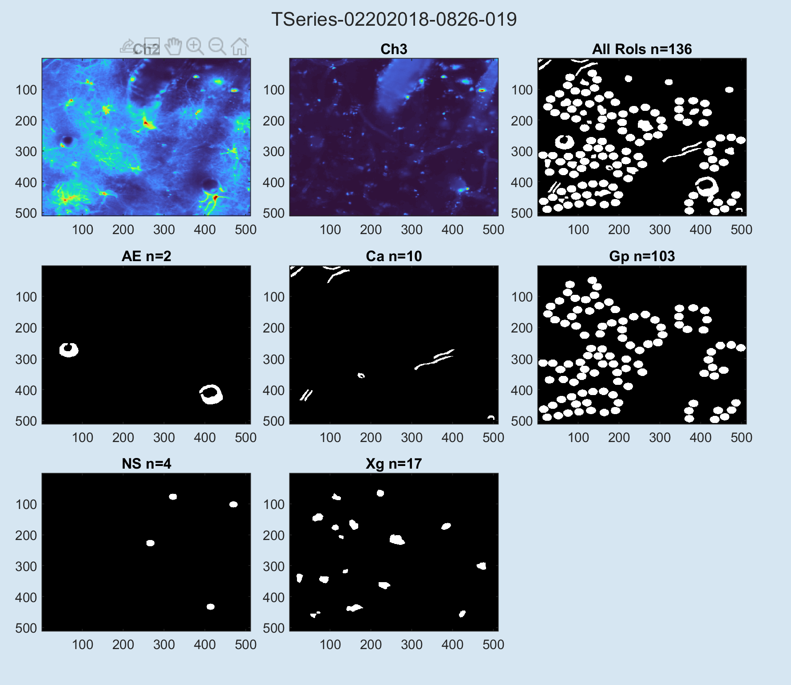
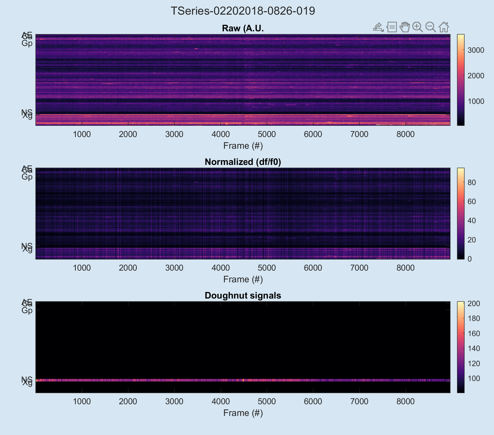


**RoI pixel activity % (RPA%)** is a measure that combines RoIs and RoAs. For simplicity, we try to refer to this as "Activity" in the user interface. 

Pure signals from RoIs suffer from lack of sensitivity when the RoIs are large, and will ignore activity outside the marked areas that may be of interest. RoAs do not discriminate between areas in the field of view, while RoIs are used to demarcate e.g. anatomical features in which indicator activity might be intersting to review separtely from other areas. 

RPA tries to alleviate this by counting events of RoIs and their active fractions. It will also produce statistics for entire groups of RoIs. Because of its use in astrocyte analysis, begonia refers to these RoI grous as compartments. The "FOV" compartmen refers to the entire field of view.


```matlab
% load the timeserseries and turn on verbose logging:
ts = begonia.scantype.find_scans("PATH-TO-TSERIES");
begonia.logging.set_level(2);  % 🙉

% extract the RPA% metric + do a QA plot:
begonia.processing.rpa.extract_signals(ts);
begonia.processing.rpa.plot_qa_rpa(ts);
```

Active fraction values are given as % of the RoI that has activity. The baseline is 0, which means event detection is easier. An active pixel in a RoI can be part of a larger activity that the RoI only partially covers. Active fraction is also subject to the RoA algorithm thresholding, temporal and spatial smoothing, and finally RoA duration and sensitivity filtering.

# MultiTable

Experiments often record complex data alongside imaging data. E.g. awake animal experiments tends to record the movement of the animal alongside neuromaging to be anatomically marked up later with RoIs and other measurements. Electrophysiological data such as EEGs is another example, or electrode readouts for slice experiments. 

When analysing, the experimenter usually want review this data together, and have timeseries data aligned in time so correlations can be found visually or programmatically. Often timeseries data is sampled at different rates and recording equipment can have different start times for their recordings, meaning corrections must be made.
In the following material, “entity” refers to what binds the data together, e.g. a trial or session.

A single recording session sometimes has multiple segments that is to be analysed separately. Examples include a period of stimulus introduced at the same time in all sessions (a “global segment”), or the animal entering specific sleep or movement state (an “entity segment”, and it’s dependent on that particular entity – usually a trial). 

Often one needs to extract traces from global or entity segments, and only analyse those, or look at what happens during transition from one segment to another.

MultiTable offers a way to:
* Collect data from multiple sources around entities, e.g. trials
* Easily add new type of data sources that labs develop / purchase to the mix
* Split the mixed data into segments derived for all or individual entities
* Extract traces around transition points for segments
* Extract specific time ranges for all traces

## Assembling mixed data
MultiTable is a table of data sources that gets queried for data and the data time information when the user wants it. You can add custom sources that fit your projects, but begonia offers a series of ready made sources that extract data from our DataLocation metadata system and outputs of the calsium analysis.

We provide sourcs for DataLocation variables stored a pure vecctors (need a deltatime to be specified), timeseries (the matlab object) and matlab timeseries collections. The two latter has no need to specify deltatime as it is included in the objects.

In this exmaple we'll get some begonia TSeries objects and create entity names from these, then add sources for drift correction, animal movement speed, whiksing state, active fraction of RoI grops and individual roi signals in two ways. 
```matlab
import begonia.data_management.multitable.MultiTable;

import begonia.data_management.multitable.add_dloc_vector;
import begonia.data_management.multitable.add_dloc_timeseries;
import begonia.data_management.multitable.add_dloc_timeseries_collection;
import begonia.data_management.multitable.add_ca_compartment;
import begonia.data_management.multitable.add_ca_roi;

% get some scans from a list of tseries:
tseries = get_some_data_somehow(); % vector of TSeries objects

% create multitable, then some entity names to cluster data around, e.g. "Session 1", "Day 32 - session 2", "Trial 42 - morning" or whatever sinks your submarine:
mtab = MultiTable();
entities = replace(string({tseries.name}), "TSeries", "Experiment");

% add drift correction traces from datalocations as category "drift":
add_dloc_vector(mtab, entities, "drift", tseries, "drift_correction_trace", [tseries.dt]);
add_dloc_timeseries(mtab, entities, "speed", tseries, "delta_angle");
add_dloc_timeseries_collection(mtab, entities, "whisk", tseries, "camera_regions", "whisker");
add_ca_compartment(mtab, entities, "ca-active-fraction", tseries, "active-fraction");
add_ca_roi(mtab, entities, "ca-roi-dff", tseries, "roi_signals_dff");
add_ca_roi(mtab, entities, "ca-roi-rpa", tseries, "roi_signal_rpa");

% get all the drift traces:
disp("By category"); 
traces = mtab.by_cat(["drift", "speed", "whisk", "ca-active-fraction", "ca-new-events", "ca-roi-dff", "ca-roi-rpa"]);
```

The screenshot below illustrates the output of the commands above. Note that the output table is the same also after segmentation (see below). Initially the segments describe the entire trace, and have the segment category "*".

Also note that sources can add custom columns to a MultiTable. In this example `add_ca_roi` added a column for the roi type the traces is read from, and `add_ca_compartment` in the same way added a column for the compartment. This allows easier filtering of the outout as it goes into analysis.

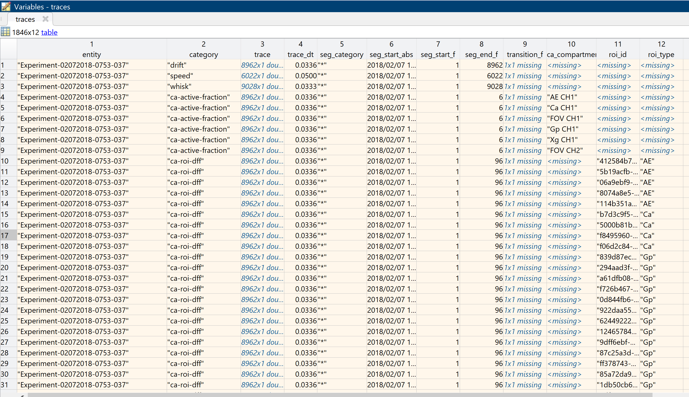

## Time alignment

Traces can be aligned in time based on the absolute start time, so that frames in the traces correlate as much as possible. Performing time alignment means all traces returned have the same start time. 

Missing data at the start of aligned traces will be padded with nans, or trimmed if the trace starts before the alignment point.

Note: performing time alignment on already segmented data can have unexpcted consequences. 

```matlab
import begonia.data_management.multitable.MultiTable;
import begonia.data_management.multitable.add_memory;
import begonia.data_management.multitable.timealign;

% make some dummy data:
fps = 30;
trace_1 = zeros(1, fps * 10);
trace_2 = zeros(1, fps * 12);
trace_3 = repmat(categorical("no-signal 😢"), 1, fps * 9);

trace_1(fps*1) = 42;
trace_2(fps*2) = 42;
trace_3(fps*3) = categorical("signal 🎉");

time_1 = datetime();
time_2 = datetime() - seconds(1);
time_3 = datetime() - seconds(2);

% add to a multitable:
dt = 1/fps;

mtab = MultiTable();

add_memory(mtab, "A", "trace 1", trace_1, dt, time_1);
add_memory(mtab, "A", "trace 2", trace_2, dt, time_2);
add_memory(mtab, "A", "trace 3", trace_3, dt, time_3)

% perform time alignment:
traces = mtab.by_entity("A");
traces_aligned = timealign(traces, "first");
```

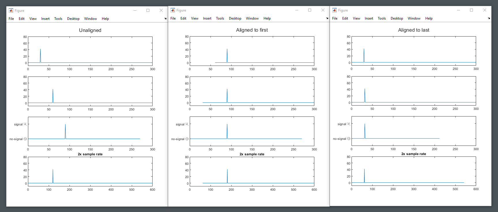

## Resampling
Traces retrieved by by_cat and by_entity_cat contain time information and can be resampled by provoding a new delta time. Performing resampling means all traces returned have the same delta time. 

```matlab
import begonia.data_management.multitable.resample;
traces = mtab.by_cat(["drift", "speed", "whisk", "ca-active-fraction", "ca-new-events", "ca-roi-dff", "ca-roi-rpa"]);
traces_10fps = resample(traces, 1/10);
```

## Global segmentation

The TSeries from the periprevious example are 5 minute sessions with awake animals where a airpuff is given in at half time. It makes sens to analyse the pre-, prei- and postpuff segments separtely. They are the same for all experiments, and is therefor a *global segmentation*.

We'll build this categorical array, the default begonia way to provide segments. Categorical arrays are good because the can be easily visualzied, re-sampled and re-segmented easily. They can also be made in a different framerate than the other data analysed.

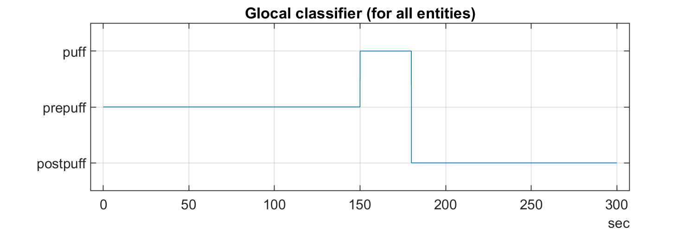

```matlab
import begonia.data_management.multitable.segment_globally;

part = categorical(["prepuff", "puff", "postpuff"]);
fps = 30;

sequence = [repmat(part(1), 1, (fps * 60 * 2.5)) ...
    repmat(part(2), 1, (fps * 60 * 0.5)) ...
    repmat(part(3), 1, (fps * 60 * 2.0))];
t = seconds((1:9000)* 1/fps);

figure("Position", [0 0 600 200]); 
plot(t, sequence); grid on; title("Glocal classifier (for all entities)");
traces = mtab.by_cat(["drift", "speed", "whisk", "ca-active-fraction", "ca-new-events", "ca-roi-rpa"]);

segs = segment_globally(traces, sequence, 1/fps, ["prepuff", "puff", "postpuff"]);

gp_puff = segs(segs.category == "ca-active-fraction" ...
    & segs.seg_category == "puff" ...
    & segs.ca_compartment == "Gp CH1",:);

figure("Position", [0 0 600 200]); 
plot(horzcat(gp_puff.trace{:}));
```
Resulting segments only contain the puff segment, showng calsium activity in the gliopil compartment:

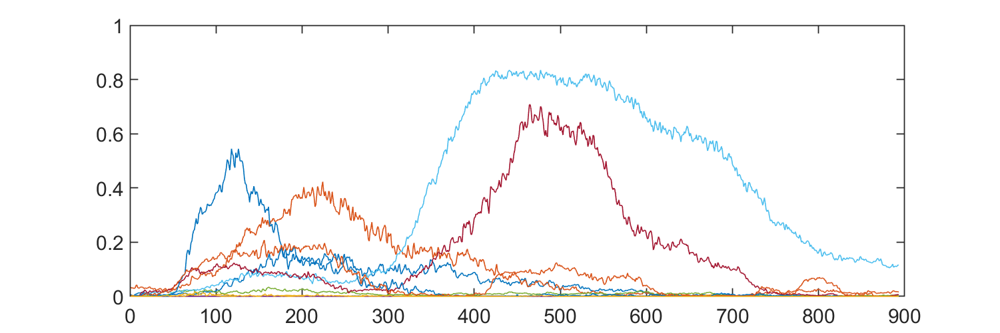

## Entity segmentation
Create a new classifier that is unique for each entity. We'll do this by loading the animal speed trace (delta angle/sec on a running wheel), and making a super simple classification. This is individual for each entity, and thus a *entity segmentation*.

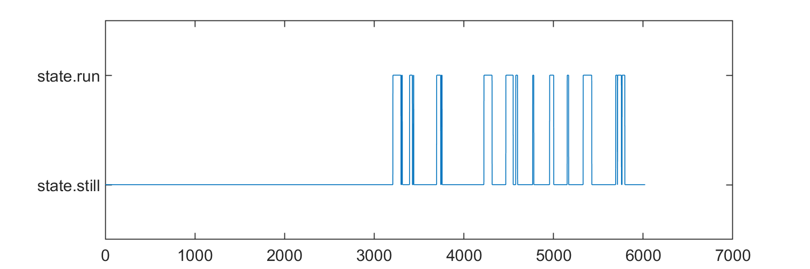

```matlab
import begonia.data_management.multitable.segment_entity;
import begonia.data_management.multitable.add_dloc_vector;

still = categorical("state.still");
running = categorical("state.run");
for ts = tseries'
    da = ts.load_var("delta_angle");
    speed = movsum(da.Data, 30) * -1;
    state = repmat(still, size(speed));
    state(speed > 50) = running;
    speed_dt = (da.TimeInfo.End - da.TimeInfo.Start) / length(speed);
    ts.save_var("test_state", state);
end

figure("Position", [0 0 600 200]); 
plot(state);
add_dloc_vector(mtab, entities, "movement-state", tseries, "test_state", repmat(speed_dt, size(tseries)));

traces = mtab.by_cat(["movement-state", "drift", "speed", "whisk", "ca-active-fraction", "ca-new-events", "ca-roi-rpa"]);
segs = segment_entity(traces, "movement-state", ["state.run"]);
```

## Merge segments from category
After segmentation, individual categories can be re-merged into single traces. The function only works if the input traces provide one unique segment pr. time pr. category. E.g., if two segments in the same category start at the same sample point, an error will arise.

Output will be *one row pr. entity* with all segments merged into one trace. Note that only duration property is valid after this processing, and that start and end columns will be set to missing.

```matlab
import begonia.data_management.multitable.segment_entity;

% get some segments:
segs = segment_entity(traces, "movement-state", ["state.run"]);

% if segments contains multiple entries pr. timepoint, such as multiple calcium compartments, they need to be filtered:
comp_segs = segs(segs.ca_compartment == "Gp", :);
merged = merge_cat_segments(comp_segs);
```

## Timerange

In this example we'll use timerange to extract a specific time range from all traces. Int his case we'll get the range that covers the airpuff, with 10 seconds baseline before. 

```matlab
import begonia.data_management.multitable.timerange;

timepoint = seconds(150);

traces = mtab.by_cat("ca-active-fraction");
rangetab = timerange(traces, timepoint - seconds(10), timepoint + seconds(40));

figure("Position", [0 0 600 200]); 
for i = 1:height(rangetab)
    plot(rangetab.trace{i});
    hold on;
end
```

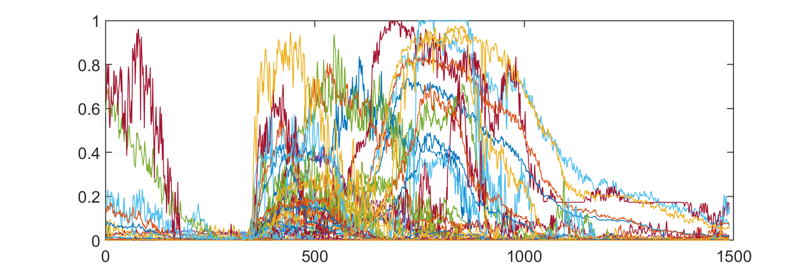

## Transitions

Any categorical array can be used to get transitions. Example: a mouse changed from being still to running, or is waking up from a specific sleep state.

In this example we continue with the pr. entity classification of moevemnt made in the entity segmentation example, and get traces at transition points. 

```matlab
import begonia.data_management.multitable.transitions_entity;

% how much trace to grab on either side of transition:
left_s = 4;
right_s = 10;

traces = mtab.by_cat(["speed", "movement-state"]);
transtab = transitions_entity(traces, "movement-state" ...
    , "state.still", "state.run", left_s, right_s);
```

## Equisizing left

To make traces of unequal frame length have an equal number of frames, use equisize left. The result will be as long as the shortest input trace.

```matlab
import begonia.data_management.multitable.equisize_left;

% all traces will now be same length and 30 fps:
eqtab = equisize_left(traces, "trim", 1/30)
```

## Generic table plot

A generic plot of all data in the multitable can be made the following way:

```matlab
import begonia.data_management.multitable.plot_entity_data;

% the figs variable will contain generic plots for the data in the multitable in the time range 0-300 seconds:
entities = ["A", "B"]
figs = plot_entity_data(mtab, entities, [0 300])
```

## Export to CSV

Data from a multitable can be exported to .csv format for digestion in systems that does not support Matlab file formats. Because traces can be very large in sum, they are split up into chunks. 

Traces can be segmented or straight from the multitable.

```matlab
import begonia.data_management.multitable.export_csv

% quick export to matlab working directory:
export_csv(traces)

% export to specific directory, 1000 traces pr. chunk
export_csv(traces, "D:\Data", 1000, "My amazing data");

```


# RoI Manager technical documentation


# Modes

RoIMan is designed to be fully keyboard driven to optimized marking large number of rois, or performing many repetitive operations. Central to using RoIMan efficiently is to understand modes. 

Initially RoIMan will be in `IDLE` mode. Switch mode by pressing `ctrl-m`, then type type the mode mnemonic, and finishing with `<enter>`.

__By example__: mark rois *E.g. paint rois, press `ctrl-m rp <enter>` for "roi paint" to enter `ROI:PAINT` mode. When entering this mode, the relevant tools will open, and you can start marking rois. To return to `IDLE` and cancel what you are doing, press `escape`. To select rois, press `ctrl-m rs <enter>` to enter `ROI:SELECT`*

| Mode | Mnemonic | Description |
| -------------| -- | ---------- | 
| Roi painting | rp | Click to paint rois |
| Roi outline | ro | Mark roi outline|
| Roi selection/delection | rs | Click to paint rois |
| Roi type switch | rts | Change roi type |
| Roi stamp circular | rc | Stamp circular rois of given size |

## 

# Technical documentation

System is a hybrid between data-driven and object oriented architecture. [ELABOREATE]

## Data documentation

There is one Manager for each loaded stack, and each view of the stack is called a View. Data is present on either manager or view, but never both. When data is changed, modules and tools will respond to changes. 

### Core
| Key | Owner | Format | Meaning     | 
| -------------| -- | ---------- |  ---------- | 
| **datatype** | m | String | The type of data being edited. currently just "timeseries" |
| **message** | m | String | Message to the user about events,such as playback looping |
| **guide_text** | m | String | Message currently rendered in help |

### Input
| Key | Owner | Format | Meaning     | 
| -------------| -- | ---------- |  ---------- | 
| **mouse_pos** | m | Struct | Contains properties win_x, win_y, viewport_x, viewport_y that corresponds to current mouse position in the viewport and the window. Note that these values can be NaN initially. |

### Mode
| Key | Owner | Format | Meaning     | 
| -------------| -- | ---------- |  ---------- | 
| **mode** | m | roiman.Mode | Current mode controller |

### Units and metrics
| Key | Owner | Format | Meaning     | 
| -------------| -- | ---------- |  ---------- | 
| **dimensions** | m | [num num]] | Width and height in units |
| **zoom** | m | num | Current zoom level. E.g. 2x = 2x zoom. |
| **viewport** | v | [num num num num] | [x, y, w, h] coordinates of views area. Used to create zoom on particular area. |  
| **unit** | m | String  | Name of stack's units (default: pixels)|
| **dunit** | m | String  | Name of units displayed (default: μm) |
| **pix_to_dunit** | m | Function  | Function to convert stack units to displayed units (default: @(r) r * tseries.dx) |
| **dunit_to_pix** | m | Function  | Function to convert stack units to displayed units (default: @(r) r / tseries.dx) |

### Stack, playback and time
Frame data is used by Main tool, the channel module and many others.

| Key | Owner | Format | Meaning     | 
| -------------| -- | ---------- |  ---------- | 
| **tseries** | m | begonia.scantype.TSeries | Current timeseries |
| **channels** | m | int[] | Channel numbers in current tseries |
| **channel_names** | m | string[] | Current timeseries |
| **matrix_ch_C** | m | H5 array (y,x,t,z) | Lazy reading H5 array for channel C (integer) |
| **ref_img_TYPE_ch_C** | m | matrix(x,y) | Reference image of TYPE (avg, std, max) for channel C (integer) |
| **z_plane** | m | num | Current z-plane (for 3D data) |
| **current_frame** | m | Int | Current frame | 
| **current_time** | m | Double | Current time in seconds | 
| **frames** | m | Int[] | List of frames in current stack | 
| **frame_time** | m | Double[] | Time in seconds for each frame in 'frames' data entry| 
| **autoplay_start_time** | m | datetime| Point in time when autoplay was at frame 1 (started, or looped around from end) | 
| **autoplay_frame_time** | m | Double[] | Time in seconds for each frame at current autoplay speed. When the view updates during autoplay, the frame to display is looked up in this list from the time since autoplay was at first frame | 

### Channel / channel module

| Key | Owner | Format | Meaning     | 
| -------------| -- | ---------- |  ---------- |
| **channel** | v | int | Channel in view |  
| **channel_mode** | v | String | Rendering mode of current view. Possible values are: Raw, Mean, Std., Max, Mean (full series), Std. (full series), Max (full series) |
| **channel_colormap** | v | String | Name of colormap to render channel with. Must be a valid matlab colormap symbol. |
| **channel_mode**  |v | String | Rendering mode of current view. Possible values are: Raw, Mean, Std., Max, Mean (full series), Std. (full series), Max (full series) |
| **channel_low** | v | Int | Start of rendering range. Values below will be omitted. |
| **channel_high** |  v | Int | End of rendering range. Values above will be omitted.  |

### RoI rendering
| Key | Owner | Format | Meaning     | 
| -------------| -- | ---------- |  ---------- | 
| **roi_table** | m | Table | Table holding all the current rois of the tseries |
| **roi_show_relations** | v | bool | Display arrows between related rois |
| **roi_show_labels** | v | bool | Display labels on rois |
| **roi_show_rois** | v | bool | Toggle RoI display |

### RoI editing (shared)

roiedit_roi_types_available m

roiedit_roi_type m

| **roiedit_selected** | m | String[] | UUID(s) of roi currentlyly selected from the roi_table |

roitool_* m : RoI tool's internal state and various data. Manager-locked.


### RoI painting


roipaint_overlay_on 

roipaint_mask

roipaint_brush_mask

roipaint_brush_circle_h 

roipaint_brush_size_px

roipaint_operation m (add/subtract)
